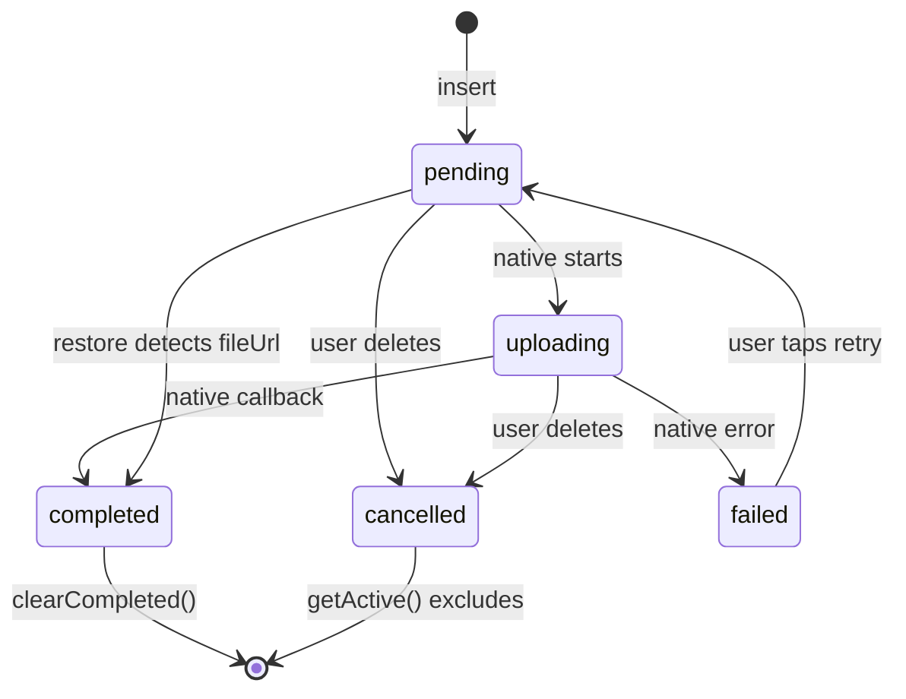
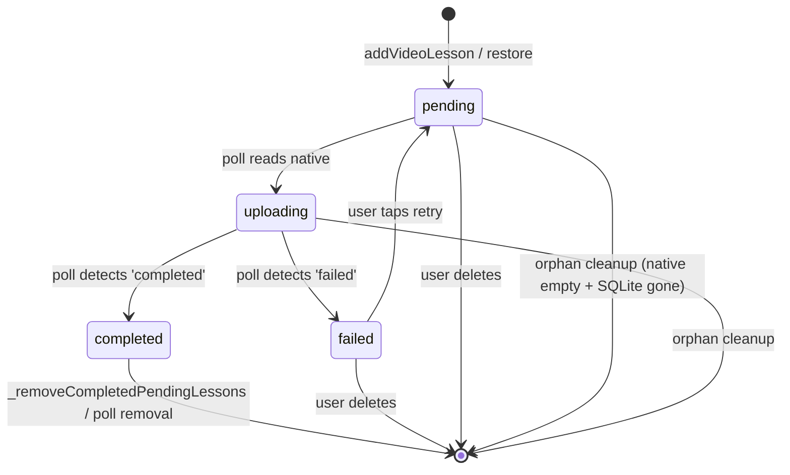

# Upload Pipeline — Workflow & Edge Cases

## Architecture Diagram

```mermaid
flowchart TB
    subgraph User["User Actions"]
        A1["Tap Add Video/Resource"]
        A2["Tap Delete (X) on pending"]
        A3["Tap Retry on failed"]
        A4["Pull to refresh"]
        A5["Navigate away & back"]
        A6["Kill & reopen app"]
    end

    subgraph Provider["ManageModuleProvider (Flutter)"]
        P1["addVideoLesson / addResourceLesson"]
        P2["deletePendingLesson"]
        P3["retryPendingLesson"]
        P4["_startProgressPolling (5s)"]
        P5["_restorePendingUploads"]
        P6["_fetchCourse / _silentRefresh"]
        P7["_checkDedupOrCleanup"]
    end

    subgraph SQLite["UploadQueueRepository"]
        DB1["insert(id, filePath, status='pending')"]
        DB2["updateStatus(id, status)"]
        DB3["markCompleted(id)"]
        DB4["deleteItem(id)"]
        DB5["getActive() → NOT IN (completed,failed,cancelled)"]
        DB6["getAll()"]
        DB7["countPending()"]
        DB8["clearCompleted()"]
    end

    subgraph Native["NativeUploadBridge (Kotlin)"]
        N1["syncQueueToNative(json)"]
        N2["startQueueProcessing()"]
        N3["getQueueItems() → items[]"]
        N4["cancelNativeUpload() → ALL"]
        N5["native_uploads.json"]
        N6["HTTP callback → POST /course/module/lesson"]
    end

    subgraph Server["Backend API"]
        S1["GET course data"]
        S2["POST /course/module/lesson (create lesson)"]
        S3["Response: lesson created"]
    end

    subgraph Init["native_init.dart (app start)"]
        I1["Phase 1: Recover from FSS"]
        I2["Phase 2: Recover native orphans"]
        I3["Phase 3: Clear stale locks"]
        I4["Phase 4: Auto-resume if needed"]
    end

    %% Flow connections
    A1 --> P1
    P1 --> P7
    P7 --> DB6
    P7 -->|"Terminal status found"| DB4
    P7 -->|"Active status found"| BLOCK["Block: Already uploading"]
    P1 -->|"Call"| UP["UnifiedUploadQueueProvider.addModuleLessonToQueue"]
    UP --> DB6
    UP --> DB1
    DB1 --> FSS["UploadPathStorage.savePath"]
    UP --> N1
    N1 --> N2
    N2 --> N5

    P4 -->|"Every 5s"| N3
    N3 -->|"items[]"| P4
    P4 -->|"status='completed'"| DB3
    DB3 --> DB8
    P4 -->|"native empty, check SQLite"| DB5
    P4 -->|"orphan found"| P4RM["Remove from _pendingLessons"]
    P4 --> P6

    A2 --> P2
    P2 --> DB2
    P2 -->|"status='cancelled'"| REMOVE["Remove from _pendingLessons"]

    A3 --> P3
    P3 --> DB2
    P3 -->|"status='pending'"| N1
    N1 --> N2

    A5 -->|"Provider recreated"| P6
    P6 --> S1
    S1 -->|"course data"| P5
    P5 --> DB5
    P5 --> N3
    P5 -->|"no native + has fileUrl"| DB3
    P5 -->|"restore pending"| P_ADDS["Add to _pendingLessons"]

    A6 --> Init
    I1 -->|"FSS has paths"| DB1
    I2 --> N5
    I2 -->|"native='completed'"| DB3
    I2 -->|"native='pending', file exists, not in SQLite"| DB1
    I4 --> DB7
    I4 -->|"pending > 0"| N1
    N1 --> N2
```

## State Machine: SQLite Row

## State Machine: _pendingLessons (in-memory)

---

## Edge Test Cases

### TC1: Happy Path — Single Video Upload
**Steps:**
1. User taps "Add Video"
2. Picks a file, enters title
3. Taps Upload

**Expected:**
- PendingLesson appears immediately after `addModuleLessonToQueue` returns queueId
- Status shows "Waiting to upload..."
- Within seconds, native starts → "Uploading X%"
- On completion → "Upload completed successfully" toast
- PendingLesson removed from UI
- `_silentRefresh` fetches course → new lesson appears
- SQLite row: inserted → `markCompleted` → `clearCompleted` deletes it

**Failure modes to verify:**
- ❌ PendingLesson shown before SQLite insert completes → FIXED: only shown after `queueId` returned
- ❌ Native never starts → polling shows "Waiting to upload..." forever → FIXED: Phase 4 handles restart

### TC2: Queue Multiple Videos
**Steps:**
1. Add Video A
2. Add Video B (different file)

**Expected:**
- Both show in UI under their respective modules
- Both start uploading (native handles ordering)
- Both complete independently
- Both lessons appear after their respective completions
- No duplicate entries

**Failure modes to verify:**
- ❌ Video B blocked by `_isQueuing` lock even after Video A's insert completed → Expected: lock released after first insert, second goes through
- ❌ Both shown as same progress → Expected: independent progress tracking

### TC3: Delete Pending Upload
**Steps:**
1. Video is uploading at 30%
2. User taps X on the pending lesson

**Expected:**
- PendingLesson removed from UI instantly
- SQLite status changed to 'cancelled'
- `getActive()` returns item → FIXED: now excludes 'cancelled'
- Native upload continues silently (no way to cancel per-item)
- When native completes → server callback fires → lesson created
- On next `_fetchCourse()` → lesson appears in module
- No duplicate re-upload on restart → FIXED: Phase 2 skips (native reports 'completed' or cleared), Phase 4 skips (status='cancelled', not 'pending')

**Failure modes to verify:**
- ❌ Deleting one pending lesson cancels ALL native uploads → FIXED: removed `cancelNativeUpload()` call
- ❌ Cancelled item restored by `_restorePendingUploads` → FIXED: `getActive()` excludes 'cancelled'
- ❌ Cancelled item re-uploaded on restart → FIXED: Phase 4 uses `countPending()` which only counts 'pending'

### TC4: Upload Fails — Retry
**Steps:**
1. Video upload fails
2. Failed item stays visible with red "Upload failed" text + retry icon
3. User taps retry

**Expected:**
- Retry icon visible only for failed items
- `retryPendingLesson` called → SQLite status reset to 'pending'
- Full active queue resynced to native (same pattern as Phase 4)
- Native restarts processing
- PendingLesson shows "Waiting to upload..." again
- Upload progresses normally

**Failure modes to verify:**
- ❌ Failed item vanishes from UI within 5 seconds → FIXED: poll no longer adds failed to `completedIds`
- ❌ No retry UI → FIXED: retry button + "Retry" text added
- ❌ Retry creates duplicate SQLite row → Expected: `updateStatus` on existing id, no new row
- ❌ Retry doesn't actually restart native → Verified: `NativeUploadBridge.syncQueueToNative` + `startQueueProcessing` called

### TC5: Upload Fails — Re-pick Same File
**Steps:**
1. Video upload fails
2. User deletes failed item (X)
3. User taps "Add Video" again
4. Picks the SAME video file from disk

**Expected:**
- Old SQLite row (status='cancelled') found by `_checkDedupOrCleanup`
- Since status is terminal ('cancelled'), old row is auto-deleted
- New SQLite row inserted with new id
- New PendingLesson shown (single entry, not duplicated)
- Normal upload

**Failure modes to verify:**
- ❌ Two entries in UI (old failed + new pending) → FIXED: `_checkDedupOrCleanup` removes old from `_pendingLessons` + deletes SQLite row
- ❌ "Already in queue" error incorrectly shown → FIXED: terminal status auto-cleans, only blocks for active status
- ❌ Old filepath still blocks → Verified: old row deleted before new insert

### TC6: Pick Same File While Upload Is Active
**Steps:**
1. Video A starts uploading (status='pending' or 'uploading')
2. User picks the SAME file again

**Expected:**
- `_checkDedupOrCleanup` finds existing row with status='pending'/'uploading'
- BLOCKED with "This file is already being uploaded"
- No duplicate entry

**Failure modes to verify:**
- ❌ Second entry created → FIXED: blocked at dedup
- ❌ First upload affected → Not possible, second attempt is rejected

### TC7: Navigate Away While Uploading, Come Back
**Steps:**
1. Video is uploading (shown as PendingLesson)
2. User navigates to another screen (provider disposed)
3. User navigates back (provider recreated)

**Expected:**
- Provider constructor → `_fetchCourse()` loads server data
- `_restorePendingUploads()` queries SQLite `getActive()`
- If video still uploading → SQLite has 'pending'/'uploading' → native also has it → restored as PendingLesson → polling starts → progress resumes
- If video completed while away → SQLite has 'completed' (from poll's `markCompleted`) → item NOT returned by `getActive()` → no restore → lesson appears from server API response
- If video completed but SQLite not updated → Phase 2 has already handled this during init → item status='completed'

**Failure modes to verify:**
- ❌ Shimmer flash on return → FIXED: `refresh()` uses silent mode when uploads active
- ❌ PendingLesson not restored → FIXED: `_restorePendingUploads` handles this
- ❌ Duplicate lesson (server created lesson during callback + restored pending creates another) → FIXED: `alreadyExistsByUrl` check in `_restorePendingUploads` detects server lesson and skips

### TC8: App Kill — Recovery From Native State
**Steps:**
1. Video uploading at 60%
2. User kills the app
3. User reopens the app

**Expected:**
- `native_init.dart` runs Phases 1-4:
  - Phase 1: FSS might have the path → inserts into SQLite if not already there
  - Phase 2: Reads native_uploads.json → item is 'uploading' → file exists → re-inserts into SQLite if missing → sets `hasStillUploading = true` → does NOT clear native state
  - Phase 3: Resets stale 'uploading' locks (only if >30 min old)
  - Phase 4: `_autoResumeIfNeeded` → native has items → restarts service only, no destructive sync
- Provider created → `_fetchCourse()` → `_restorePendingUploads()` → restores PendingLesson
- Polling resumes → progress continues from 60%

**Failure modes to verify:**
- ❌ Native state overwritten by SQLite sync → FIXED: Phase 4 checks native first, skips sync if native has items
- ❌ Upload restarts from 0% → Not possible, native service resumes from stored progress in native_uploads.json
- ❌ PendingLesson not restored → FIXED: `_restorePendingUploads` reads from SQLite

### TC9: App Kill — Upload Completed While Away
**Steps:**
1. Video at 90% upload
2. User kills app
3. Native service finishes upload + callback in background
4. User reopens app later

**Expected:**
- `native_init.dart` Phases:
  - Phase 1: FSS path might be removed by Phase 6 on normal flow, or still present if killed
  - Phase 2: native_uploads.json → item is 'completed' or native cleared state → if 'completed' → `markCompleted` in SQLite → if native cleared (`!hadNativeState`) → checks SQLite 'uploading' items with fileUrl → marks 'completed'
  - Phase 3: 'completed' items not affected by stale lock reset
  - Phase 4: `countPending()` → 0 (item marked 'completed' or deleted) → no sync
- Provider created → `_fetchCourse()` → server has lesson (from native callback) → appears in UI
- No pending lesson shown

**Failure modes to verify:**
- ❌ Video re-uploaded (duplicate on server) → FIXED: Phase 2 marks as 'completed', Phase 4 sees 0 pending
- ❌ PendingLesson shown even though upload completed → FIXED: `_restorePendingUploads` checks `alreadyExistsByUrl` + native state
- ❌ Lesson not visible in course → This requires the server callback to have succeeded; if it didn't, lesson doesn't exist. This is a server-side issue.

### TC10: Rapid Double-Tap "Add Video"
**Steps:**
1. User taps "Add Video" twice in quick succession
2. File picker opens twice (Android behavior)

**Expected:**
- First tap → file picker opens
- Second tap → another file picker or ignored
- User picks a file in one picker
- `addVideoLesson` called → `_isQueuing = true` → processes
- If user picks a file in the second picker → `addVideoLesson` called but `_isQueuing = true` → "Please wait, another file is being queued" → returns false
- User needs to try again after first completes

**Failure modes to verify:**
- ❌ Two uploads started for the same pick → Expected: `_isQueuing` blocks second
- ❌ `_isQueuing` never released → Verified: `finally` block always runs
- ❌ Duplicate SQLite inserts → `_isQueuing` + dedup both prevent

### TC11: Pull-to-Refresh During Active Upload
**Steps:**
1. Video uploading at 40%
2. User pulls to refresh

**Expected:**
- `refresh()` called → `_pendingLessons.isNotEmpty == true` → `_fetchCourse(silent: true)`
- No shimmer shown
- Course data refreshed silently
- PendingLesson remains visible
- Upload continues uninterrupted after refresh

**Failure modes to verify:**
- ❌ Shimmer replaces UI, pending lesson disappears → FIXED: silent mode skips `_isLoading = true` + shimmer
- ❌ Upload interrupted → Not possible, native runs in separate process
- ❌ Polling timer cancelled → Not affected by refresh

### TC12: Delete Module With Pending Uploads
**Steps:**
1. Module A has a pending video upload
2. User deletes Module A

**Expected:**
- Server API deletes module
- SQLite rows for all pending items in Module A marked 'cancelled'
- `_pendingLessons` entries for Module A removed
- Native upload continues (cannot stop per-item)
- When native completes → server callback tries to create lesson → 404 or error (module gone) → error logged by native service
- Lesson never appears in UI (module is gone)

**Failure modes to verify:**
- ❌ Native upload cancelled for all items → FIXED: no `cancelNativeUpload()` call
- ❌ Pending items re-appear after module deletion → FIXED: `_pendingLessons.removeWhere` + SQLite status='cancelled'
- ❌ Broken state where module is deleted but pending lesson still shows → FIXED: both SQLite and in-memory cleaned

### TC13: Stuck at 100% (Native Reports Uploading at 100%)
**Steps:**
1. Upload reaches 100% in native
2. Native hasn't fired server callback yet (status='uploading' at progress=100)

**Expected:**
- Poll reads progress=100, status='uploading'
- PendingLesson shows "Uploading 100%"
- Next poll cycle (5s later):
  - If callback succeeded → status='completed' → `markCompleted` in SQLite → removed from `_pendingLessons` → `_silentRefresh()`
  - If callback still pending → still 'uploading' at 100%
- Eventually transitions to 'completed'

**Failure modes to verify:**
- ❌ Stuck at 100% forever if native clears state → FIXED: Fix B in polling — when native empty, checks SQLite for orphaned items with fileUrl → marks completed
- ❌ Stuck at 100% forever if native dies → PendingLesson stays visible until app restart. On restart, Phase 2 checks native state → native_uploads.json was likely cleared on normal exit → Phase 2 marks any 'uploading' items with fileUrl as 'completed' → no re-upload. Acceptable.

### TC14: Network Error During Course Fetch
**Steps:**
1. Pull to refresh
2. Network unavailable

**Expected:**
- `_fetchCourse` → network call fails → `response.isSuccess` is false
- `_isLoading` set to false (or remains true if silent)
- Shimmer or empty state shown
- PendingLessons unaffected (they're in-memory + SQLite)
- On retry, course data loads normally

**Failure modes to verify:**
- ❌ PendingLessons wiped due to network error → FIXED: network error path doesn't touch `_pendingLessons`
- ❌ App stuck in loading state → FIXED: `_isLoading = false` set even on error in non-silent mode

### TC15: Server Returns Stale Data After Upload Completion
**Steps:**
1. Upload completes, poll detects 'completed'
2. `_silentRefresh()` called → server hasn't processed callback yet → no new lesson in response
3. PendingLesson removed from UI
4. Timer stops (nothing left pending)

**Expected:**
- `completedIds.isNotEmpty` → timer stops → schedules `Future.delayed(10s)` → `_silentRefresh()`
- After 10s → fresh API call → if server processed callback → lesson appears
- If server still hasn't processed → no lesson yet → user sees blank
- Next `_fetchCourse()` (pull-to-refresh or next session) → lesson appears

**Failure modes to verify:**
- ❌ Lesson never appears → Fixed by follow-up refresh; if server never processes callback, lesson never appears (server issue)
- ❌ PendingLesson removed but no replacement → Acceptable — follow-up refresh catches it; if not, pull-to-refresh works

### TC16: Leave App While Queuing
**Steps:**
1. User taps "Add Video" → `_isQueuing = true` → insert into SQLite
2. User leaves app (home button)
3. SQLite has item, native hasn't been synced yet

**Expected:**
- `_isQueuing` remains true until method completes (sync to native + return)
- If interrupted before sync → SQLite has item, FSS has path, but native doesn't
- On next app open:
  - Phase 1: FSS has path → inserts into SQLite (or skips if already there)
  - Phase 4: `countPending()` > 0 → syncs to native → starts processing
- Provider loaded after init → `_restorePendingUploads` finds pending item → shows PendingLesson

**Failure modes to verify:**
- ❌ Duplicate SQLite insert (Phase 1 + original insert) → Phase 1 checks `alreadyQueued` → skips if already in SQLite
- ❌ Native never gets the item → Phase 4 handles this

### TC17: Very Long Filenames / Special Characters
**Steps:**
1. User picks a file with 200+ character filename containing unicode and special chars

**Expected:**
- SQLite stores the path as-is (TEXT column)
- Native receives the path in JSON
- Native service reads the file
- Upload proceeds normally

**Failure modes to verify:**
- ❌ SQLite insert fails → SQLite handles TEXT up to ~1 billion chars, safe
- ❌ JSON encoding fails → `jsonEncode` handles unicode strings, safe
- ❌ Native bridge crashes → Depends on Kotlin implementation; out of Flutter scope

### TC18: FSS Recovery on Fresh Install
**Steps:**
1. User uninstalls and reinstalls the app
2. SQLite database is gone
3. FlutterSecureStorage may or may not persist (varies by platform)

**Expected:**
- If FSS persists (iOS Keychain, Android EncryptedSharedPreferences survive reinstall):
  - Phase 1 finds paths → checks if file exists → if yes, inserts into fresh SQLite → upload resumes
  - If file was already uploaded and deleted → file doesn't exist → skips → no phantom upload
- If FSS is cleared:
  - Phase 1 finds nothing → skips
  - No uploads to recover

**Failure modes to verify:**
- ❌ Phantom upload of a deleted file → Phase 1 checks `File(filePath).existsSync()` → if file was cleaned up, skipped
- ❌ Duplicate server lesson → If file exists and was already uploaded → re-upload creates duplicate. This is an inherent risk of FSS persistence across reinstalls. Mitigation: `alreadyExistsByUrl` check in `_restorePendingUploads` prevents UI duplicate but server still gets the request.

### TC19: 2GB+ Large File Upload
**Steps:**
1. User picks a 2GB+ video file
2. Taps "Add Video"

**Expected:**
- `addVideoLesson` checks `File(videoFile.path).lengthSync()` → `fileSize > _maxUploadFileSize`
- Rejected immediately with toast: "File too large (2.0GB). Maximum is 2GB."
- No SQLite insert, no native sync, no pending lesson created
- User can pick a smaller file

**Failure modes to verify:**
- ❌ Metadata extraction hangs for minutes before rejection → FIXED: size check runs before any metadata work
- ❌ File triggers native OOM/crash loop → FIXED: prevented at queue entry point
- ❌ Partial file inserted → Never happens, early return before any insert

#### If file size is near limit but under 2GB:
- Metadata extraction might be slow → Acceptable (native reports 0% → stuck detection waits 30s → marks failed)
- Native service might still fail → Stuck detection catches it after 30s → "Upload failed to start" toast
- User can retry or pick a smaller file

### TC20: Large File Recovery Loop (Resuming Uploads in Notification)
**Steps:**
1. A 1.5GB file was successfully queued before the size check was added
2. Native service repeatedly crashes processing it
3. Each crash shows "Resuming Uploads" notification
4. UI shows 0% stuck

**Expected:**
- After 30s (6 poll cycles at 5s), stuck-at-0% detection fires
- Item marked as 'failed' with "Upload did not start — file may be too large"
- Native service stops restarting (SQLite row now 'failed', Phase 4 skips it)
- User sees red "Upload failed" in UI with retry/delete options
- Retry would fail again (native still can't handle it) → user deletes and picks smaller file

**Failure modes to verify:**
- ❌ Stuck detection never fires → At cycle 6, `_stuckPollCount[queueId] >= _stuckPollThreshold` → marks failed
- ❌ Item keeps getting re-queued by native → Phase 4 uses `countPending()` which excludes 'failed'
- ❌ Notification loop continues after marking failed → Native might still restart if it hasn't read the updated SQLite. If native has its own queue in native_uploads.json, we'd need to clear it. Acceptable: on next app restart, Phase 2 recovers and sees 'failed' in SQLite → doesn't restore.

### TC21: Two Devices, Same Account
**Steps:**
1. User uploads Video A from Device 1
2. User opens same course on Device 2
3. Server has Video A's lesson on Device 2's course data

**Expected:**
- Device 2 loads course data → sees Video A lesson
- Device 2's `_restorePendingUploads` → SQLite might have no items → no PendingLessons
- Independent uploads on each device → no conflict

**Failure modes to verify:**
- ❌ Device 2 tries to re-upload Video A → Not possible, Video A's file is only on Device 1

---

## Summary of All Fixes Applied

| Round | Area | Issue Fixed |
|-------|------|-------------|
| R1 | `native_init.dart` | Phase 4 no longer destructively overwrites native state |
| R1 | `manage_module_provider.dart` | Silent refresh prevents shimmer/reload loop |
| R1 | `manage_module_screen.dart` | Null videoUrl guard prevents crash |
| R2 | `manage_module_provider.dart` | Failed items stay visible; `retryPendingLesson` added; polling await + follow-up refresh |
| R2 | `manage_module_provider.dart` | `deletePendingLesson` no longer blanket-cancels all native uploads |
| R2 | `manage_module_provider.dart` | `_isRefreshing` guard; `refresh()` uses silent mode when uploads active |
| R2 | `manage_module_provider.dart` | `deleteModule` marks pending items cancelled in SQLite |
| R2 | `manage_module_provider.dart` | `_isQueuing` lock serializes add operations |
| R2 | `module_card.dart` | Retry button; dead code removed; "Finalizing..." → "Upload complete" |
| R3 | `manage_module_provider.dart` | Poll calls `markCompleted` before `clearCompleted` (SQLite status sync) |
| R3 | `manage_module_provider.dart` | Empty native state → cross-reference SQLite → clean orphans |
| R3 | `manage_module_provider.dart` | `_restorePendingUploads` checks native state before restoring items with fileUrl |
| R3 | `upload_queue_repository.dart` | `getActive()` and `countActive()` exclude 'cancelled' status |
| R4 | `manage_module_provider.dart` | `_checkDedupOrCleanup` — all-status dedup with auto-cleanup of terminal rows |
| R4 | `unified_upload_queue_provider.dart` | Same all-status dedup in `addModuleLessonToQueue` + `addResourceToQueue` |
| R4 | `manage_module_provider.dart` | Clearer `_isQueuing` lock message |

## Still Not Fixed (Server/Native Boundary)

1. **Per-item native cancellation** — `cancelNativeUpload()` is blanket-only; Kotlin change required
2. **Server-side idempotency** — `POST /course/module/lesson` should return 409 for duplicate `(moduleId, videoUrl)`; backend change required
3. **Native SQLite status sync** — Kotlin process never updates SQLite; adding this would eliminate complexity in Phase 2 recovery
4. **Upload progress streaming** — Polling (5s) is adequate but not ideal; SSE/WebSocket would be better
5. **Two-device duplicate** — Same file uploaded from two devices creates two lessons; server dedup would prevent this
